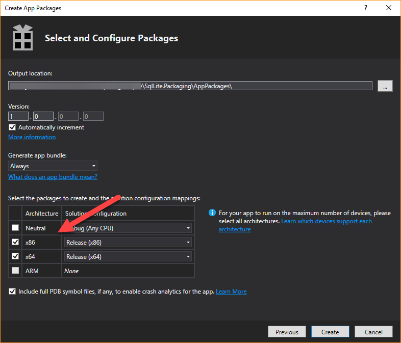

# Handling platform-specific dependencies on Centennial projects

## Setting

So, it happens from time to time that developers struggle with failed WACK results when they use platform-specific dependencies, such as SQLite-NET. 
The binaries only come in x86 and x64 flavor (e.g. through NuGet) but never platform-agnostic. I've put a simple WPF project on GitHub that saves some weather data into a local SQLite persistence. 
I will use this sample codebase to demonstrate the resulting issue and two possible solutions.

## The issue
When running the app in a native win32 mode, AnyCPU platform configuration works perfectly fine,

 

as both platform-specific runtimes are provided and the most suitable one is selected on execution. 

Now, what happens when we convert this AnyCPU app to a Store app using Desktop Bridge? Chances are, the app will still run as Windows tries to pick the right dependency or falls back to x86.

However, the AppxManifest sets the processor-architecture. So, although the app might run, there will be a mismatch between the reported app processor-architecture and the processor-architecture of the provided dependencies. This mismatch will be found by the WACK tool and will fail the overall test result. (Resulting in not getting the RFT waiver and thus not being able to publish the app at all)

How can you set this straight? There are two ways, if you're are using Visual Studio 2017 to develop your app you can go the very easy way. If you rely on other IDEs or have an extended build chain, some minor use of the commandline is required.

## The easy solution
In Visual Studio 2017 create a new project in your solution, of type Windows Application Packaging Project.

Add your Win32 application to the *Applications* dependency list. Once you have done that, you can right-click on the project and select *Store* -> *Create App Packages...*

This starts a wizard that guides you through the creation of a package for each platform and combines them into a single appxbundle. Neat!
Make sure to uncheck the 'Neutral' architecture and check both x86 and x64!

Hit create! This will result in an appxbundle that contains both processor specific versions of your app.

The wizard will finally take you to an extra step to test the resulting package. Needless to say, it passes the tests.

## The almost easy solution

